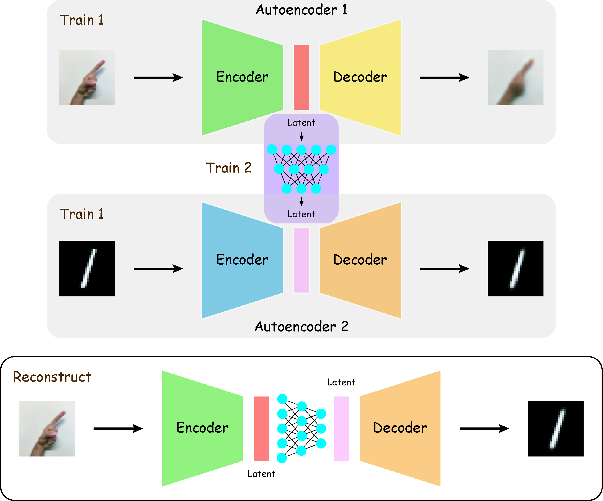

# Linked Autoencoders - by Keras

## Summary



## Build Autoencoders

-- Based on pre-trained CNN model for classification

### Tricks - Use pre-trained classification model

### Build Convolutional Neural Networks (CNN)

-- Recognize (Classification) HandSign and HandWrite (MNIST) images

### Tricks - Data Augmentation

---


---

## Linked Latent Layer

-- Just a simple Neural Network


---

## Additional - VAE

---

#### PS

This idea was raise up when I was processing single cell DNA sequencing data.

If you treat the call segment process, which usually use CBS or HMM algorithm, as a dimensional reduction process from the raw copy number data, then maybe you can use a AE to do that.

So I thought I need two AE, one for "dimensional reduction" the raw data, the other one for "dimensional reduction" the segment data (generated by CBS/HMM as training set). Then, use a neural network to link two latent layers.

To do that, first I will try this idea on machine learning benchmark dataset (MNIST), then I will try on real (DNA sequencing) dataset.

If it works, I will create another repository. Hopefully, we can get a neural network version of segment caller!

---

#### BTW

This repository is a branch from a **Private** repository.

[Retaining History When Moving Files Across Repositories in Git](https://stosb.com/blog/retaining-history-when-moving-files-across-repositories-in-git/)

```bash
git clone <repo-A> <tmp> # Clone repo-A and rename
cd <tmp>
git remote rm origin # Avoid mess up repo-A
git filter-branch --subdirectory-filter <folder> -- --all # Keep files (in repo-A/folder) that you want to transfer

cd <repo-B> # Goto repo-B
git remote add repo-A-branch <tmp> # Add branch
git pull repo-A-branch master --allow-unrelated-histories # Merge
```
