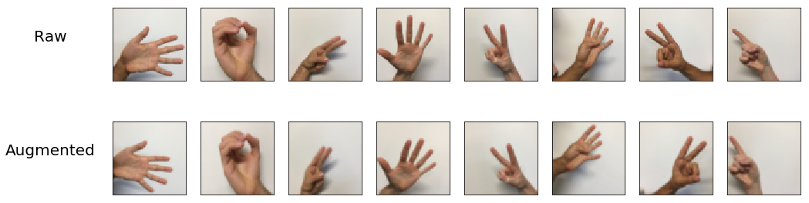
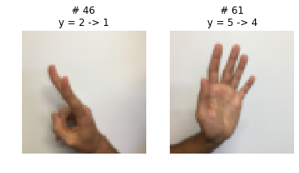
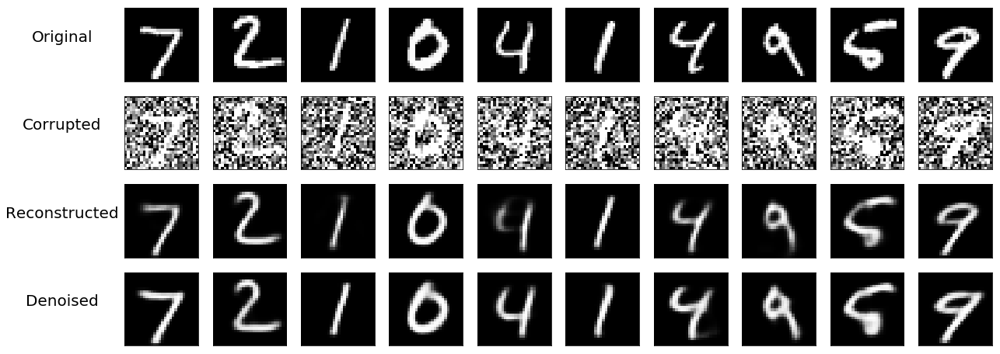
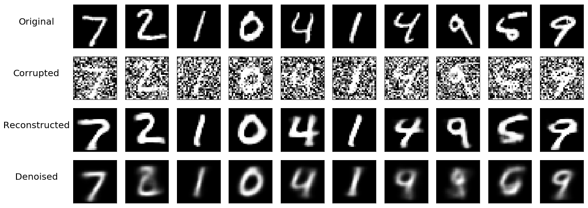
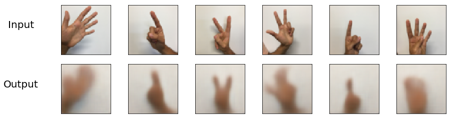
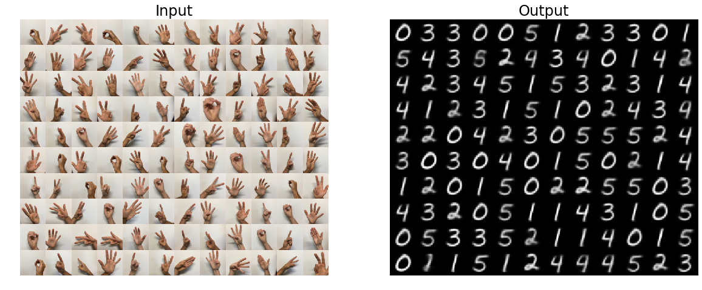
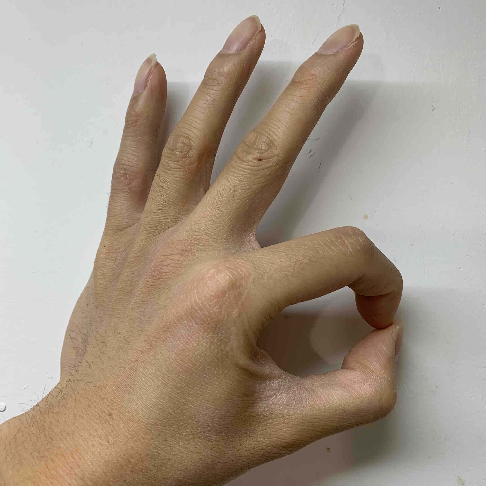
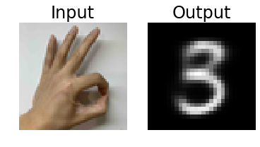

# Linked Autoencoders - by Keras

<!-- TOC depthFrom:2 depthTo:4 withLinks:1 updateOnSave:1 orderedList:0 -->

- [Summary](#summary)
- [What is Autoencoder (AE)?](#what-is-autoencoder-ae)
- [Three Steps](#three-steps)
	- [Trick: Use pre-trained classification model](#trick-use-pre-trained-classification-model)
- [Build Convolutional Neural Networks (CNN)](#build-convolutional-neural-networks-cnn)
	- [For MNIST dataset](#for-mnist-dataset)
	- [For HandSign dataset](#for-handsign-dataset)
		- [Trick: Data Augmentation](#trick-data-augmentation)
		- [Trick: Stack CNN, LeakyReLU](#trick-stack-cnn-leakyrelu)
- [Build Autoencoders from CNN classifier](#build-autoencoders-from-cnn-classifier)
	- [For MNIST dataset](#for-mnist-dataset)
		- [Additional: Denoising AE](#additional-denoising-ae)
	- [For HandSign dataset](#for-handsign-dataset)
- [Linked Latent Layer](#linked-latent-layer)
- [Check out the model](#check-out-the-model)
- [Additional: VAE](#additional-vae)

<!-- /TOC -->

## Summary


---

## What is Autoencoder (AE)?

[Keras blog: building-autoencoders-in-keras](https://blog.keras.io/building-autoencoders-in-keras.html)

## Three Steps

- **Step 1**: Train Autoencoders on two datasets (**Train 1**)
  - MNIST
  - HandSign (from [deeplearning.ai](https://www.floydhub.com/deeplearningai/datasets/signs))
- **Step 2**: Train neural network that link two latent layers (**Train 2**)
- **Step 3**: **Reconstruct** the model

### Trick: Use pre-trained classification model

Both of our datasets are images, usually we use convolutional neural network (**CNN**) to extract the feature in the images. There are many instances/examples that use CNN to perform classification/recognizing for both datasets and can get pretty good result.

So maybe the CNN model, which was trained for classification, already "learned" the latent representation of the data.

If that is true, the our **Step 1** will be separated into two step:
- Step 1a: Build CNN model for classification
- Step 1b: Use pre-trained model to build AE (Drop top layer, fix weight)

There is a very good code example that [jointly train autoencoder and classifier](https://github.com/keras-team/keras/issues/10037#issuecomment-387213211). In fact, this code train a classifier and autoencoder simultaneously, but I think "train a classifier -> fix weight -> train a autoencoder (decoder)" is a different case (Am I right?), so let's start in my way.

---

## Build Convolutional Neural Networks (CNN)

-- Recognize (Classification) HandSign and HandWrite (MNIST) images

### For MNIST dataset

A piece of cake.

```python
# pseudo-code
model = Sequential()
model.add( Conv2D(
    32, kernel_size=3,
    activation='relu', padding='same',
    input_shape=(28,28,1))
)
model.add( MaxPooling2D() )
model.add( Dropout(0.2) )

model.add( Conv2D(
    64, kernel_size=3,
    activation='relu', padding='same')
)
model.add( MaxPooling2D() )
model.add( Dropout(0.2) )

model.add( Flatten() )
model.add( Dense(32, activation='relu')
model.add( Dense(10, activation='softmax') )

model.compile(
    loss='categorical_crossentropy',
    optimizer='adadelta',
    metrics=['accuracy']
)

model.fit( epochs=10 ...)
model.evaluate(...)
# Test accuracy: 0.9913

```

### For HandSign dataset

The HandSign dataset is really small: 1080 for Training, 120 for Testing. And it is also noisy and have more pixel (64 x 64 x 3).

Although there are some examples that have good accuracy ([by Tensorflow](https://github.com/mesolmaz/HandSigns_CNN)), I tried one of them, it can get good result in classification, but not work well in autoencoder.

So I build one in my way.

#### Trick: Data Augmentation

<i>Small dataset + Noisy, biggest enemy of machine learning.</i>

**Data Augmentation** is a powerful tool that can _create new data from existing one_ through shifting/shearing/rotating/flipping.



This trick can "increase the size of data from nowhere" and make your model more robust.

[Keras blog: building-powerful-image-classification-models-using-very-little-data](https://blog.keras.io/building-powerful-image-classification-models-using-very-little-data.html)

```python
# Code
train_datagen = ImageDataGenerator( rescale=1./255,
    width_shift_range  = 0.1,
    height_shift_range = 0.1,
    shear_range        = 0.7,
    zoom_range         = 0.1,
    rotation_range     = 25,
    horizontal_flip    = True,
    vertical_flip      = False,
    fill_mode          = 'nearest',
)
```

#### Trick: Stack CNN, LeakyReLU

```python
signs_inputs = Input(name='SIGNS', shape=(64,64,3,))

x2 = signs_inputs
x2 = Conv2D( 32, kernel_size=3, padding='same', name='Conv2D-1-1' )(x2)
x2 = LeakyReLU(                                 name='LReLU-1-2'  )(x2)
x2 = Conv2D( 32, kernel_size=3, padding='same', name='Conv2D-1-3' )(x2)
x2 = LeakyReLU(                                 name='LReLU-1-4'  )(x2)
x2 = MaxPooling2D(                              name='MaxPool-1-5')(x2)
x2 = Dropout(0.4,                               name='Dropout-1-6')(x2)

x2 = Conv2D( 64, kernel_size=3, padding='same', name='Conv2D-2-1' )(x2)
x2 = LeakyReLU(                                 name='LReLU-2-2'  )(x2)
x2 = Conv2D( 64, kernel_size=3, padding='same', name='Conv2D-2-3' )(x2)
x2 = LeakyReLU(                                 name='LReLU-2-4'  )(x2)
x2 = MaxPooling2D(                              name='MaxPool-2-5')(x2)
x2 = Dropout(0.4,                               name='Dropout-2-6')(x2)

x2 = Conv2D( 64, kernel_size=3, padding='same', name='Conv2D-3-1' )(x2)
x2 = LeakyReLU(                                 name='LReLU-3-2'  )(x2)
x2 = Conv2D( 64, kernel_size=3, padding='same', name='Conv2D-3-3' )(x2)
x2 = LeakyReLU(                                 name='LReLU-3-4'  )(x2)
x2 = MaxPooling2D(                              name='MaxPool-3-5')(x2)
x2 = Dropout(0.2,                               name='Dropout-3-6')(x2)

x2 = Flatten(                                   name='Flatten'    )(x2)
x2 = Dense(512, activation='relu',              name='FC-Latent'  )(x2)
x2 = Dense(6,   activation='softmax',           name='Softmax'    )(x2)
signs_pred = x2

signs_cnn_model = Model(inputs=signs_inputs, outputs=signs_pred, name='SIGNS_CNN')

signs_cnn_model.compile(
    loss='categorical_crossentropy',
    optimizer='adadelta',
    metrics=['accuracy']
)

history = signs_cnn_model.fit_generator(
    train_datagen.flow(X_train_orig, Y_train, batch_size=32, shuffle=True),
    epochs=30,
    ...
)
# Test accuracy: 0.9666666666666667
```

There are two mis-predict example. It is excusable, right? ^_^



---

## Build Autoencoders from CNN classifier

-- Based on pre-trained CNN model for classification

### For MNIST dataset

A piece of cake.

```python
# Encoder
mnist_encoder = Model(
    inputs  = mnist_cnn_model.input,
    outputs = mnist_cnn_model.get_layer(mnist_cnn_model.layers[-2].name).output,
    name    = 'MNIST_encoder'
)
mnist_encoder.trainable = False

# Decoder
mnist_z = Input(name='MNIST_Z', shape=(mnist_encoder.output.shape[1].value,))
x1 = Dense(7*7*64, activation='relu',      name='Latent-dFC')(mnist_z)
x1 = Reshape((7, 7, 64),                   name='Reshape'   )(x1)
x1 = Conv2DTranspose( 64, kernel_size=3,
    activation='relu',     padding='same', name='deConv2D-1')(x1)
x1 = UpSampling2D(                         name='UpSample-1')(x1)
x1 = Conv2DTranspose( 32, kernel_size=3,
    activation='relu',     padding='same', name='deConv2D-2')(x1)
x1 = UpSampling2D(                         name='UpSample-2')(x1)
x1 = Conv2DTranspose( 1, kernel_size=3,
    activation='sigmoid',  padding='same', name='deConv2D-3')(x1)
mnist_decoded = x1

mnist_decoder = Model(
    inputs  = mnist_z,
    outputs = mnist_decoded,
    name    = 'MNIST_decoder'
)

# Combine Encoder + Decoder
mnist_autoencoder = Model(
    inputs  = mnist_cnn_model.input,
    outputs = mnist_decoder( mnist_encoder(mnist_cnn_model.input) ),
    name    = 'MNIST_autoencoder'
)
# Using `binary_crossentropy` as loss function
# https://stats.stackexchange.com/questions/245448/loss-function-for-autoencoders
# https://stats.stackexchange.com/questions/394582/why-is-binary-cross-entropy-or-log-loss-used-in-autoencoders-for-non-binary-data
mnist_autoencoder.compile(optimizer='adadelta', loss='binary_crossentropy')

mnist_autoencoder.fit(
    x_train, x_train,
    epochs=10,
    ...
)
```

#### Additional: Denoising AE

--- Also a **Trick**, add noise to the data

We "manually" add some random/gaussian noise into the data, because these noise are random, so they will help the model to recognize the "real" patten/distribution/representation of the data, make the model more robust, even in sometimes the noise make our human really hard to recognize the images.

This version of AE is call the denoising AE (dAE).

dAE on MNIST:
```
Reconstructed = Original  -> dAE
Denoised      = Corrupted -> dAE
```



```python
x_train_noisy = x_train + np.random.normal(loc=0.5, scale=0.5, size=x_train.shape)
x_test_noisy  = x_test  + np.random.normal(loc=0.5, scale=0.5, size=x_test.shape)

x_train_noisy = np.clip(x_train_noisy, 0, 1)
x_test_noisy  = np.clip(x_test_noisy,  0, 1)

# x =    noisy data
# y = original data
# Otherwise the autoencoder can't know how to remove noise
# https://ramhiser.com/post/2018-05-14-autoencoders-with-keras/
mnist_autoencoder.fit(
    x_train_noisy, x_train,
    epochs=30,
    ...
)
```

A interesting result is that if I used the pre-trained CNN, the dAE result is **worse** than the "fresh trained (without non-trainable)" dAE.

This result indicated that the previous CNN (encoder) is less robust. So maybe every CNN should trained under this "random noise version" of data.

dAE on MNIST with non-trainable:



### For HandSign dataset

Tricky part: `ImageDataGenerator`

```python
# https://github.com/keras-team/keras/issues/3923#issuecomment-251185669
def fixed_generator(generator):
    for batch in generator:
        yield (batch, batch)

history = signs_autoencoder.fit_generator(
    fixed_generator(
        train_datagen.flow(X_train_orig, batch_size=32, shuffle=True)
    ),
    epochs=150,
    ...
)
```



---

## Linked Latent Layer

-- Just a simple Neural Network



```python
# Prepare the data
link_data_in  = np.array([])
link_data_out = np.array([])

link_data_in.shape  = (0,128)
link_data_out.shape = (0,32)

for n in range(0,6):
    signs_idx = np.where(Y_train_orig == n)[0]
    mnist_idx = np.where(y_train_orig == n)[0]

    n_signs = int(signs_idx.shape[0])
    n_times = int(mnist_idx.shape[0]/n_signs)
    n_total = n_times*n_signs

    data_iter = train_datagen.flow( X_train_orig[signs_idx], batch_size=n_signs, shuffle=False)

    signs_aug = np.array([])
    signs_aug.shape = (0,64,64,3)
    for _ in range( n_times ):
        signs_aug = np.vstack( (signs_aug, data_iter.next()) )

    signs_latent = signs_encoder.predict(signs_aug)
    mnist_latent = mnist_encoder.predict(x_train[mnist_idx[:n_total]])

    link_data_in  = np.vstack( (link_data_in,  signs_latent) )
    link_data_out = np.vstack( (link_data_out, mnist_latent) )

# Model
signs_Latent = Input(
	name  = 'SIGNS_Latent',
	shape = (signs_encoder.outputs[0].shape[1].value,)
)
x = Dense(256, activation='relu', name='Link-1'   )(signs_Latent)
x = Dropout(rate=0.3,             name='Dropout-2')(x)
x = Dense(128, activation='relu', name='Link-3'   )(x)
x = Dropout(rate=0.2,             name='Dropout-4')(x)
x = Dense(32,  activation='relu', name='Link-5'   )(x)
mnist_Latent = x

signs_to_mnist_linker = Model(
    inputs  = signs_Latent,
    outputs = mnist_Latent,
    name    = 'S_to_M_Linker'
)
signs_to_mnist_linker.compile(optimizer='adadelta', loss='mse')
signs_to_mnist_linker.fit( epochs=20 ... )

signs_to_mnist = Model(
    name    = 'signs_to_mnist',
    inputs  = signs_encoder.inputs,
    outputs = mnist_decoder(
                  signs_to_mnist_linker(
                      signs_encoder(signs_encoder.inputs)
                  )
              )
)
```

## Check out the model

For now, our Linked model looks great in training and testing. So, let's test it on real image!

<div align=center></br></br></div>

I took a picture as a input using my **iPhone**. As you can see, I used a **different version of hand sign** for number **3**. The model had **NEVER** seen this hand sign during training and testing. And also, this hand sign has some part that looks like 0, so maybe the model will think this is a ZERO, let's see the result:

<div align=center></br></br></div>

BOOM! GREAT! I got a GOOD and ROBUST model! `~_~`

## Additional: VAE

---

##### PS

This idea was raise up when I was processing single cell DNA sequencing data.

If you treat the call segment process, which usually use CBS or HMM algorithm, as a dimensional reduction process from the raw copy number data, then maybe you can use a AE to do that.

So I thought I need two AE, one for "dimensional reduction" the raw data, the other one for "dimensional reduction" the segment data (generated by CBS/HMM as training set). Then, use a neural network to link two latent layers.

To do that, first I will try this idea on machine learning benchmark dataset (MNIST), then I will try on real (DNA sequencing) dataset.

If it works, I will create another repository. Hopefully, we can get a neural network version of segment caller!

---

##### BTW

This repository is a branch from a **Private** repository.

[Retaining History When Moving Files Across Repositories in Git](https://stosb.com/blog/retaining-history-when-moving-files-across-repositories-in-git/)

```bash
# Clone repo-A and rename
git clone <repo-A> <tmp>
# Goto repo-A
cd <tmp>
# Avoid mess up repo-A
git remote rm origin
# Keep files (in repo-A/folder) that you want to transfer
git filter-branch --subdirectory-filter <folder> -- --all

# Goto repo-B
cd <repo-B>
# Add branch
git remote add repo-A-branch <tmp>
# Merge
git pull repo-A-branch master --allow-unrelated-histories
# Done
```
